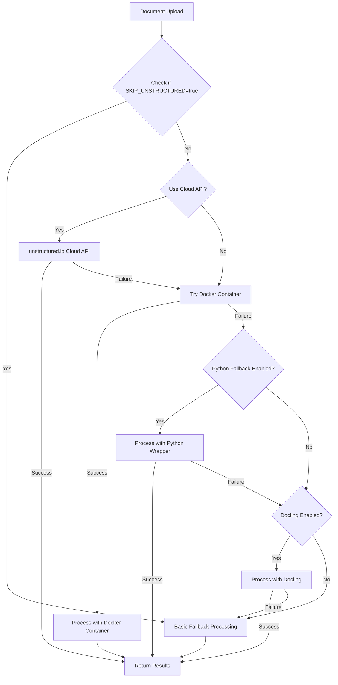

# Apple Silicon Document Processing Support

## Problem Statement

The current advanced document processing implementation uses unstructured.io through a Docker container, which has limitations on Apple Silicon (ARM64) systems. Currently, on Apple Silicon systems, the implementation skips unstructured.io processing entirely and falls back to basic text extraction, which has limited capabilities compared to the full implementation.

## Solution Overview

We've designed a multi-layered approach to document processing that provides several fallback mechanisms to ensure robust processing across all platforms:



### Layered Fallback Approach

1. **unstructured.io Docker Container** - Try the multi-platform Docker image first
2. **Python unstructured.io Wrapper** - If Docker fails, use the Python library directly
3. **Docling Processor** - As an alternative document processor option
4. **Basic Fallback Processor** - Simplest approach that works on all platforms

## Implementation Components

We've created several documents that detail different aspects of the implementation:

1. [MULTI_PLATFORM_PROCESSING.md](./MULTI_PLATFORM_PROCESSING.md) - Overview of the multi-platform approach and architecture
2. [DOCLING_INTEGRATION.md](./DOCLING_INTEGRATION.md) - Details on integrating Docling as an alternative processor
3. [MULTI_PLATFORM_IMPLEMENTATION_PLAN.md](./MULTI_PLATFORM_IMPLEMENTATION_PLAN.md) - Detailed code changes required

## Key Changes

### 1. Docker Compose Updates

We'll update the unstructured.io Docker configuration to use the multi-platform image:

```yaml
unstructured:
  image: downloads.unstructured.io/unstructured-io/unstructured:latest
  ports:
    - '8000:8000'
  command: python -m uvicorn unstructured.api:app --host 0.0.0.0 --port 8000
```

### 2. Enhanced ARM64 Detection

Instead of skipping unstructured.io on ARM64, we'll try the Docker approach first and use fallbacks as needed:

```bash
# Check if on ARM64 (Apple Silicon)
if [[ $(uname -m) == "arm64" ]]; then
    echo "Detected ARM64 architecture. Attempting multi-platform approach..."
    # Try to start unstructured.io container, setup fallbacks, etc.
```

### 3. Layered Processing Implementation

We'll enhance the `advanced-file-processor.ts` with new methods:

- `processDocumentWithPythonUnstructured()` - Uses Python directly
- `processDocumentWithDocling()` - For future Docling integration
- Enhanced `processDocumentWithUnstructured()` - Implements the fallback chain

### 4. New Configuration Options

```
# Force skip unstructured.io (use if nothing else works)
FORCE_SKIP_UNSTRUCTURED=true

# Enable Python wrapper fallback
ENABLE_PYTHON_FALLBACK=true

# Enable docling processor (future)
USE_DOCLING=true
```

## Implementation Steps

1. Update Docker Compose file
2. Modify startup script to better handle ARM64
3. Enhance file processor with new fallback methods
4. Update environment configuration
5. Test on both x86_64 and ARM64 systems

## Benefits

- Better document processing on Apple Silicon Macs
- More robust fallback mechanisms for all platforms
- Enhanced error handling and diagnostics
- Future extensibility with Docling integration

## Next Steps

To implement these changes, please switch to Code mode and follow the detailed implementation plan in [MULTI_PLATFORM_IMPLEMENTATION_PLAN.md](./MULTI_PLATFORM_IMPLEMENTATION_PLAN.md).