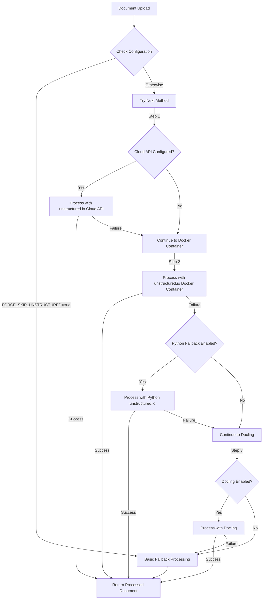

# Multi-Platform Document Processing

This document outlines the multi-layered approach to document processing in Morphic, designed to provide robust functionality across different platforms, particularly addressing the challenges with Apple Silicon (ARM64) machines.

## Architecture Overview

The document processing system now employs a layered fallback approach with multiple processing options:



## Processing Methods

### 1. unstructured.io Docker Container

The preferred method uses a multi-platform Docker image of unstructured.io that should work on both x86_64 and ARM64 architectures. This provides the best document chunking and extraction capabilities.

```yaml
# From docker-compose.yaml
unstructured:
  image: downloads.unstructured.io/unstructured-io/unstructured:latest
  ports:
    - '8000:8000'
  command: python -m uvicorn unstructured.api:app --host 0.0.0.0 --port 8000
  volumes:
    - unstructured_cache:/root/.cache
```

### 2. Python unstructured.io Wrapper

If the Docker container fails (especially on ARM64 systems), the system can use the Python unstructured.io library directly. This requires the Python library to be installed on the host system.

```python
# Simplified example of the Python wrapper approach
from unstructured.partition.auto import partition
from unstructured.chunking.title import chunk_by_title

elements = partition('document.pdf')
chunks = chunk_by_title(elements, combine_text_under_n_chars=1000, overlap=200)
```

### 3. Docling Processor

An alternative open-source document processing library that can be used when unstructured.io is not available. See `DOCLING_INTEGRATION.md` for details.

### 4. Basic Fallback Processing

A simple text extraction method that works on all platforms but with limited capabilities:
- Basic text extraction from PDFs using pdf-parse
- Simple text chunking by paragraphs
- No special handling for tables, images, or complex formats

## Configuration Options

The multi-platform approach is controlled through several environment variables:

| Variable | Description |
|----------|-------------|
| `USE_ADVANCED_FILE_PROCESSING` | Enable the advanced processing pipeline |
| `FORCE_SKIP_UNSTRUCTURED` | Bypass all unstructured.io methods and use basic processing |
| `SKIP_UNSTRUCTURED` | Legacy option for backward compatibility |
| `ENABLE_PYTHON_FALLBACK` | Enable the Python wrapper fallback option |
| `USE_DOCLING` | Enable the Docling processor fallback |
| `USE_UNSTRUCTURED_CLOUD_API` | Use the unstructured.io cloud API (requires API key) |
| `UNSTRUCTURED_API_KEY` | API key for cloud unstructured.io |
| `UNSTRUCTURED_API_URL` | URL for the unstructured.io API endpoint |

## Platform-Specific Considerations

### Apple Silicon (ARM64)

On Apple Silicon machines, the startup script will:
1. Attempt to use the multi-platform Docker image of unstructured.io
2. Automatically enable Python fallback as a contingency
3. Add Docling as an option that can be enabled manually

### x86_64 Systems

On traditional x86_64 systems:
1. The Docker container is used by default
2. Fallbacks are still available but less likely to be needed

## Monitoring and Diagnostics

The enhanced processing system includes improved logging to help diagnose issues:

```typescript
console.log(`Trying document processing with: ${methodName}`);
// After processing:
console.log(`Successfully processed document with: ${methodName}`);
// Or if failed:
console.warn(`Failed to process with ${methodName}:`, error);
```

## Implementation Details

The implementation is modular and easily extensible:

- Each processing method is encapsulated in its own function
- The system tries each method in sequence based on configuration
- New processing methods can be added by implementing a compatible interface
- Error handling preserves information for debugging but ensures graceful degradation

For the detailed code implementation, see `lib/utils/advanced-file-processor.ts`.

## Testing and Verification

To test the implementation:
1. Run `./start-advanced-processing.sh` which will detect your platform and set up the appropriate services
2. Check the Docker containers: `docker ps | grep -E "redis|qdrant|unstructured"`
3. Upload a document in the application and observe the processing logs
4. Try different document types to test the robustness of the processing

## Future Enhancements

Future improvements to the multi-platform processing could include:
1. More sophisticated chunking strategies tailored to document types
2. Additional document processors for specialized formats
3. Performance benchmarking to automatically select the best method
4. Metrics collection to track processing success rates