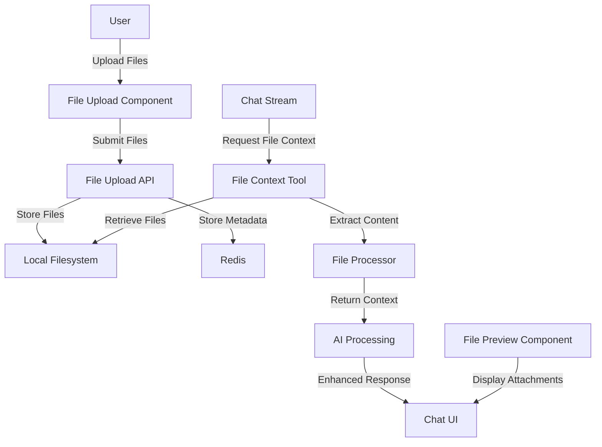
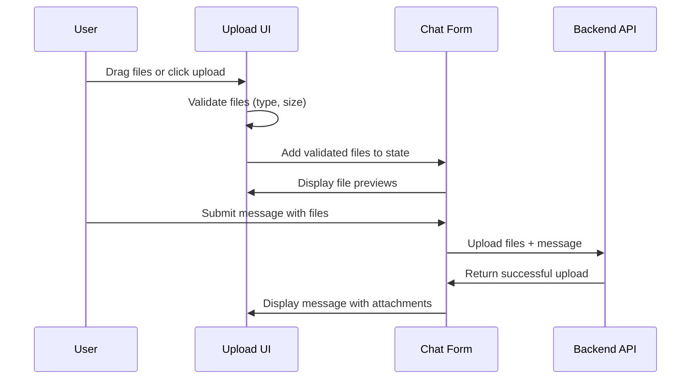
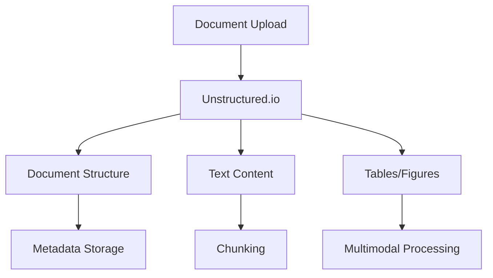

# File Attachment Feature Architecture Plan

## Overview

This document outlines the architecture and implementation plan for adding file attachment capabilities to the Morphic chat application. This feature will enable users to upload multiple file types (PDFs, images, text, code) that the AI can analyze and use as context for responses.

## System Architecture

### High-Level Overview



### Key Components

1. **File Upload System**: Frontend components for selecting and previewing files
2. **File Storage System**: Local filesystem storage with Redis metadata
3. **Content Extraction**: Services to process files and extract usable text
4. **Context Integration**: Methods to incorporate file content into AI prompts
5. **UI Components**: Elements to display and interact with attachments

## Data Flow and Storage

### File Storage System

- **Directory Structure**:
  ```
  /uploads
    /<user_id>
      /<chat_id>
        /<file_id>.<extension>
  ```

- **Metadata Storage**:
  - Store file metadata in Redis alongside chat data
  - File references will be added to the Chat schema

### Data Models

```typescript
// New types for file attachments
interface FileAttachment {
  id: string;
  originalName: string;
  storagePath: string;
  mimeType: string;
  size: number;
  uploadedAt: Date;
  extractedText?: string;
}

// Update Chat interface
interface Chat {
  // existing fields...
  attachments?: FileAttachment[];
}

// Update Message interface
interface Message {
  // existing fields...
  attachments?: FileAttachment[];
}
```

## Backend Implementation

### API Routes

#### 1. File Upload Endpoint (`/api/attachments/upload`)

- Handles multipart form data uploads
- Validates files (size, type, security)
- Stores files in filesystem
- Extracts text content where applicable
- Returns file metadata for client use

```typescript
// Example route implementation
export async function POST(req: Request) {
  const formData = await req.formData();
  const files = formData.getAll('files') as File[];
  const chatId = formData.get('chatId') as string;
  const userId = getUserId(req);
  
  const uploadResults = await Promise.all(
    files.map(file => processAndStoreFile(file, userId, chatId))
  );
  
  return Response.json({ files: uploadResults });
}
```

#### 2. File Retrieval Endpoint (`/api/attachments/:id`)

- Retrieves files by ID
- Handles authentication and authorization
- Serves file with appropriate content type
- Supports range requests for large files

### File Processing Services

#### Content Extraction

- **Text Files**: Direct reading with encoding detection
- **PDF Documents**: Extract text using a PDF parsing library
- **Images**: OCR processing for text extraction
- **Code Files**: Syntax-aware parsing with language detection

```typescript
// File processor factory
function createFileProcessor(mimeType: string): FileProcessor {
  switch(true) {
    case mimeType.startsWith('text/'):
      return new TextFileProcessor();
    case mimeType === 'application/pdf':
      return new PdfProcessor();
    case mimeType.startsWith('image/'):
      return new ImageProcessor();
    // Additional processors
    default:
      return new DefaultProcessor();
  }
}
```

#### Redis Integration

- Update Redis schemas to include file references
- Add file metadata to chat objects
- Implement cleanup routines for orphaned files

```typescript
// Example Redis schema update
async function saveFileMetadata(file: FileAttachment, chatId: string) {
  const redis = await getRedis();
  await redis.hset(`file:${file.id}`, file);
  await redis.sadd(`chat:${chatId}:files`, file.id);
}
```

## Frontend Components

### Modifications to Existing Components

#### `chat-panel.tsx`
- Add file attachment state
- Add file upload button
- Modify form submission
- Add file preview area

#### `chat.tsx`
- Update the useChat hook to handle file attachments
- Modify message handling to support messages with attachments

#### `message.tsx` and `render-message.tsx`
- Extend rendering to display file attachments in messages
- Add file preview capabilities

### New Components

#### `file-upload.tsx`
```typescript
interface FileUploadProps {
  onFilesSelected: (files: File[]) => void;
  maxSize?: number;
  allowedTypes?: string[];
  maxFiles?: number;
}
```
- Drag and drop upload area
- File selection button
- Progress indicators
- File type validation logic

#### `attachment-preview.tsx`
```typescript
interface AttachmentPreviewProps {
  files: FileAttachment[];
  onRemove: (fileId: string) => void;
  isUploading?: boolean;
  uploadProgress?: Record<string, number>;
}
```
- Display selected files before sending
- Show file icons, names, and sizes
- Provide remove option for each file
- Display upload progress

#### `message-attachment.tsx`
```typescript
interface MessageAttachmentProps {
  attachment: FileAttachment;
  onClick?: () => void;
}
```
- Render attachments within messages
- Handle different file types (image, PDF, code, text)
- Provide preview and download options

#### `file-viewer.tsx`
- Modal component for viewing files
- Support for previewing different file types
- Fallback to download for unsupported types

### Frontend Implementation Details

#### File Upload Flow



#### File Input Implementation

```typescript
// In chat-panel.tsx
const fileInputRef = useRef<HTMLInputElement>(null)

const handleFileSelect = (e: React.ChangeEvent<HTMLInputElement>) => {
  if (e.target.files && e.target.files.length > 0) {
    const filesArray = Array.from(e.target.files)
    // Validate files
    const validFiles = validateFiles(filesArray)
    setAttachments(prev => [...prev, ...validFiles])
  }
}

// File input element in JSX
<input
  type="file"
  ref={fileInputRef}
  onChange={handleFileSelect}
  multiple
  accept="image/*,.pdf,.txt,.md,.js,.ts,.py,.html,.css"
  className="hidden"
/>

<Button 
  onClick={() => fileInputRef.current?.click()}
  variant="ghost"
  size="icon"
  className="rounded-full"
>
  <Paperclip className="h-5 w-5" />
</Button>
```

#### Drag and Drop Implementation

```typescript
// In file-upload.tsx
const [isDragging, setIsDragging] = useState(false)

const handleDragOver = (e: React.DragEvent) => {
  e.preventDefault()
  setIsDragging(true)
}

const handleDragLeave = (e: React.DragEvent) => {
  e.preventDefault()
  setIsDragging(false)
}

const handleDrop = (e: React.DragEvent) => {
  e.preventDefault()
  setIsDragging(false)
  
  if (e.dataTransfer.files && e.dataTransfer.files.length > 0) {
    const filesArray = Array.from(e.dataTransfer.files)
    onFilesSelected(filesArray)
  }
}

// JSX component
<div 
  className={`upload-area ${isDragging ? 'dragging' : ''}`}
  onDragOver={handleDragOver}
  onDragLeave={handleDragLeave}
  onDrop={handleDrop}
>
  {/* Upload content */}
</div>
```

#### State Management

```typescript
// Current state
interface ChatState {
  messages: Message[];
  input: string;
  isLoading: boolean;
  // ...
}

// Extended state
interface EnhancedChatState {
  messages: Message[];
  input: string;
  isLoading: boolean;
  attachments: FileAttachment[];
  uploadProgress: Record<string, number>;
  isUploading: boolean;
  // ...
}
```

## AI Integration

### File Context Tool

We'll create a new AI tool to access and use file content within the chat:

```typescript
export const fileContextTool = tool({
  description: 'Access content from attached files',
  parameters: fileContextSchema,
  execute: async ({ fileId, page, query }) => {
    // Retrieve file metadata
    const fileMetadata = await getFileMetadata(fileId);
    
    // Get extracted content or process on-demand
    let content = fileMetadata.extractedText;
    if (!content) {
      content = await extractFileContent(fileMetadata);
    }
    
    // If searching or paging, filter content accordingly
    if (query) {
      content = searchContent(content, query);
    }
    
    if (page) {
      content = getContentPage(content, page);
    }
    
    return {
      content,
      fileName: fileMetadata.originalName,
      fileType: fileMetadata.mimeType,
      totalPages: calculateTotalPages(content)
    };
  }
});
```

### Context Window Management

For larger files that exceed model context windows:

1. **Chunking Strategy**:
   - Split large documents into semantic chunks
   - Use semantic similarity to retrieve relevant chunks
   - Prioritize chunks most relevant to the query

2. **Summarization**:
   - Create summaries of large documents
   - Provide overviews plus specific details

3. **Selective Loading**:
   - Allow users or AI to request specific sections
   - Implement "page" navigation for large files

### Integration with Existing Stream Handling

We need to update the tool execution pipeline:

```typescript
// Update in lib/streaming/tool-execution.ts
export async function executeToolCall(
  coreMessages: CoreMessage[],
  dataStream: DataStreamWriter,
  model: string,
  searchMode: boolean,
  attachments?: FileAttachment[] // New parameter
): Promise<ToolExecutionResult> {
  // Existing code...
  
  // Add file context if attachments are present
  if (attachments && attachments.length > 0) {
    const fileContext = await generateFileContext(attachments, query);
    systemPrompt += `\n\nThe following files are attached: ${fileContext.summary}`;
    
    // Add file tool capability
    availableTools.push('file_context');
  }
  
  // Rest of function...
}
```

## Open-Source Document Processing and Local Implementation

To ensure data privacy, performance, and flexibility, we'll leverage open-source tools for document processing and content extraction. This approach keeps all document processing within our infrastructure without relying on external APIs.

### Document Processing with Unstructured.io

We'll use the open-source implementation of Unstructured.io (not the hosted API service) for document processing:



#### Self-Hosted Unstructured.io

```yaml
# docker-compose addition for unstructured
services:
  unstructured:
    image: quay.io/unstructured-io/unstructured-api:latest
    ports:
      - "8000:8000"
    environment:
      - LOG_LEVEL=INFO
    volumes:
      - ./temp_files:/tmp
```

#### Integration Implementation

```typescript
// Document processor using local Unstructured.io service
class UnstructuredProcessor implements FileProcessor {
  private apiUrl = 'http://localhost:8000/general/v0/general';
  
  async processFile(filePath: string): Promise<ProcessedFile> {
    const formData = new FormData();
    formData.append('files', fs.createReadStream(filePath));
    
    // Optional parameters for more control
    formData.append('strategy', 'hi_res');
    formData.append('chunking_strategy', 'by_title');
    
    const response = await fetch(this.apiUrl, {
      method: 'POST',
      body: formData,
    });
    
    const elements = await response.json();
    
    // Process elements into a structured format
    return this.buildDocumentStructure(elements);
  }
  
  private buildDocumentStructure(elements: any[]): ProcessedFile {
    // Transform unstructured elements into our document model
    // Group by section, extract text, identify tables/figures, etc.
    // ...implementation details...
  }
}
```

### Local Vector Embeddings

We'll use Hugging Face models hosted locally for generating embeddings:

```typescript
import { pipeline } from '@xenova/transformers';

class LocalEmbeddingService {
  private model;
  private ready: boolean = false;
  
  constructor() {
    this.initialize();
  }
  
  private async initialize() {
    // Load a lightweight, efficient embedding model
    this.model = await pipeline('feature-extraction', 'Xenova/all-MiniLM-L6-v2');
    this.ready = true;
  }
  
  async getEmbeddings(texts: string[]): Promise<number[][]> {
    if (!this.ready) await this.waitForReady();
    
    const embeddings = [];
    // Process in batches to manage memory
    for (const batch of this.createBatches(texts, 16)) {
      const results = await Promise.all(
        batch.map(text => this.model(text, { pooling: 'mean', normalize: true }))
      );
      embeddings.push(...results.map(r => Array.from(r.data)));
    }
    
    return embeddings;
  }
}
```

### Vector Storage with Qdrant

For efficient similarity search:

```typescript
import { Qdrant } from 'qdrant';

class VectorStore {
  private client: Qdrant;
  private collectionName: string = 'document_chunks';
  
  constructor() {
    // Local Qdrant instance
    this.client = new Qdrant({
      url: 'http://localhost:6333'
    });
    this.ensureCollection();
  }
  
  async search(vector: number[], limit: number = 5): Promise<any[]> {
    const result = await this.client.search(this.collectionName, {
      vector,
      limit,
      with_payload: true
    });
    
    return result.map(hit => ({
      id: hit.id,
      score: hit.score,
      metadata: hit.payload
    }));
  }
}
```

### Multimodal Processing

For handling images and other non-text elements:

```typescript
import { createWorker } from 'tesseract.js';
import { pipeline } from '@xenova/transformers';

class MultimodalProcessor {
  private ocrWorker;
  private captionModel;
  
  async initialize() {
    // Initialize OCR worker
    this.ocrWorker = await createWorker('eng');
    
    // Initialize local image captioning
    this.captionModel = await pipeline('image-to-text', 'Xenova/vit-gpt2-image-captioning');
  }
  
  async processImage(imagePath: string): Promise<{text: string, caption: string}> {
    // Extract text using OCR
    const { data } = await this.ocrWorker.recognize(imagePath);
    
    // Generate caption
    const captions = await this.captionModel(imagePath);
    
    return {
      text: data.text,
      caption: captions[0].generated_text
    };
  }
}
```

### Document Semantic Chunking

For large documents, we'll use semantic boundaries rather than fixed-size chunks:

```typescript
function chunkBySection(paperStructure: PaperStructure): DocumentChunk[] {
  return paperStructure.sections.map(section => ({
    id: generateUniqueId(),
    title: section.heading,
    content: section.content,
    metadata: {
      sectionLevel: section.level,
      documentId: paperStructure.id,
      position: section.startPosition
    }
  }));
}

function recursiveChunk(content: string, maxSize: number): DocumentChunk[] {
  if (getTokenCount(content) <= maxSize) {
    return [{ id: generateId(), content }];
  }
  
  // Try splitting by subsections, then paragraphs, then sentences
  const subsections = splitBySubsections(content);
  if (subsections.length > 1) {
    return subsections.flatMap(subsection => recursiveChunk(subsection, maxSize));
  }
  
  // If no subsections, split by paragraphs
  // ...implementation
}
```

### Context Assembly for AI Prompts

To optimize the use of context window:

```typescript
function assembleContext(
  query: string,
  documentInfo: DocumentStructure,
  selectedChunks: DocumentChunk[],
  maxContextSize: number
): string {
  let context = '';
  let tokenCount = 0;
  
  // Start with document metadata (low token count, high value)
  const metadataContext = `Title: ${documentInfo.title}
Authors: ${documentInfo.authors.join(', ')}
Abstract: ${documentInfo.abstract}`;
  
  context += metadataContext;
  tokenCount += estimateTokens(metadataContext);
  
  // Add table of contents for navigation
  const tocContext = `Document Structure:
${documentInfo.sections.map(s => `${'  '.repeat(s.level-1)}- ${s.heading}`).join('\n')}`;
  
  context += '\n\n' + tocContext;
  tokenCount += estimateTokens(tocContext);
  
  // Add chunks until we approach max context size
  for (const chunk of sortedChunks) {
    // Implementation for adding chunks with prioritization
    // ...
  }
  
  return context;
}
```

## Implementation Plan

### Phase 1: Core Storage and Upload (Week 1)
- Set up file storage directory structure
- Implement file upload API endpoint
- Create basic UI components for file selection
- Update types and Redis schema

**Tasks:**
- [ ] Create uploads directory and structure
- [ ] Implement file validation utilities
- [ ] Create file upload API route
- [ ] Add basic file input to chat panel
- [ ] Update Chat type to include attachments

### Phase 2: File Processing (Week 2)
- Implement text extraction for different file types
- Add PDF parsing capabilities
- Implement image OCR capabilities
- Add code file parsing

**Tasks:**
- [ ] Create file processor interface and implementations
- [ ] Implement PDF content extraction
- [ ] Add OCR capabilities for images
- [ ] Create code file parser
- [ ] Implement content chunking strategies

### Phase 3: AI Integration (Week 3)
- Create file context tool
- Update model registry
- Integrate with chat stream
- Enhance system prompts

**Tasks:**
- [ ] Create file context tool and schema
- [ ] Update tool execution pipeline
- [ ] Modify system prompts to use file content
- [ ] Implement context window management strategies

### Phase 4: Polish and Testing (Week 4)
- Improve UI experience
- Add error handling
- Comprehensive testing
- Documentation

**Tasks:**
- [ ] Enhance UI components with better styling
- [ ] Add error handling for failed uploads
- [ ] Implement progress indicators
- [ ] Create comprehensive documentation
- [ ] Test with various file types and sizes

## Technical Considerations

### 1. Performance

- **File Size Limits**:
  - Set reasonable file size limits (e.g., 10MB per file)
  - Implement chunked uploads for larger files

- **Processing Efficiency**:
  - Use worker threads for CPU-intensive tasks
  - Consider batch processing for multiple files

- **Caching**:
  - Cache extracted content to avoid repeated processing
  - Use Redis TTL for temporary storage

### 2. Security

- **File Validation**:
  - Validate file types and content
  - Scan for malicious content
  - Sanitize filenames to prevent path traversal

- **Access Control**:
  - Implement proper authorization for file access
  - Ensure users can only access their own files
  - Use signed URLs for file retrieval

- **Privacy**:
  - Clear guidance on data retention
  - Option to delete files after chat session

### 3. Error Handling

- **Upload Failures**:
  - Graceful handling of failed uploads
  - Retry mechanisms for temporary issues
  - Clear error messages for users

- **Processing Errors**:
  - Fallback strategies when extraction fails
  - Default to file download when preview is unavailable

- **Edge Cases**:
  - Handle corrupted files
  - Deal with unsupported file types
  - Manage very large files

### 4. User Experience

- **Progressive Enhancement**:
  - Basic functionality without JS
  - Enhanced experience with modern browsers

- **Accessibility**:
  - Keyboard navigation for file upload
  - Screen reader support
  - Proper ARIA attributes

- **Mobile Support**:
  - Touch-friendly file selection
  - Responsive file previews
  - Efficient use of limited screen space

## Conclusion

This architecture plan provides a comprehensive roadmap for implementing file attachment capabilities in the Morphic chat application. By following this plan, we can create a robust, secure, and user-friendly feature that enhances the AI's ability to work with user-provided content.

The implementation is designed to be modular and extensible, allowing for future enhancements such as additional file type support, improved content extraction, and more sophisticated AI context management.